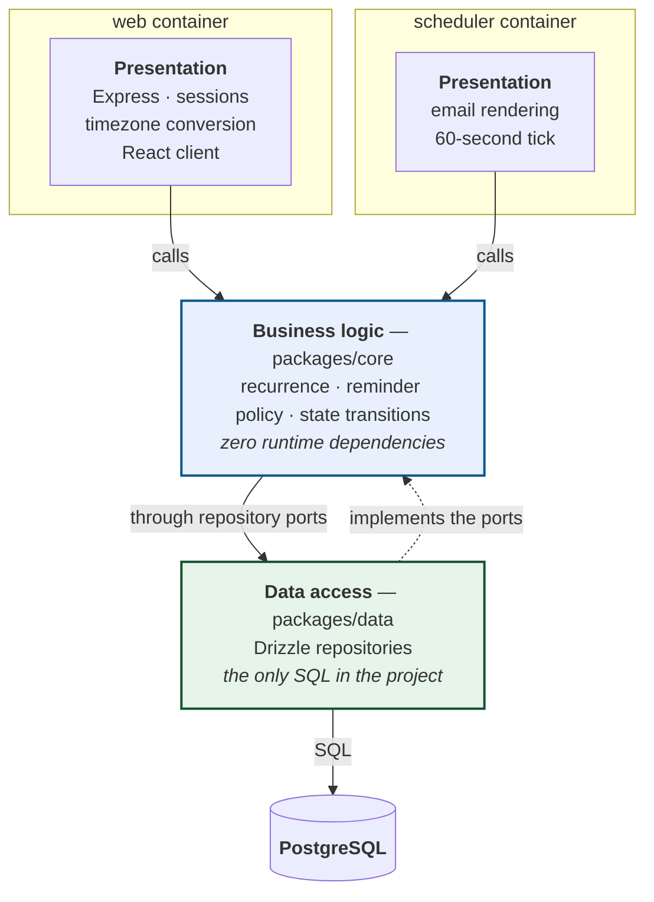

# Task manager with an independent reminder scheduler

A self-hosted task manager: register, create tasks with deadlines, priorities
and recurrence rules, and receive email reminders delivered by a **separate
scheduler process** that shares the application's business logic and data access
layers but has an entirely independent lifecycle.

## Prerequistes

- This repository cloned
- docker installed
- postgresql installed (for tests)

## Setup

From the root of this project, create an `.env` file with the following credentials:

```bash
SMTP_HOST=smtp.gmail.com
SMTP_PORT=587
SMTP_USER=yourgmail@gmail.com
# This needs to be created from your gmail account, go to manage account, search
# for "App passwords", follow the steps and copy the 16 character string here. (you must have 2 factor auth enables on your account)
SMTP_PASS=yourapppassword
SMTP_FROM=yourgmail@gmail.com
```

## Run it

Start the application

```bash
docker compose up
```

It will be running on **<http://localhost:3000>**.

**Demo account:** `demo@example.com` / `demo1234` - Already has some tasks configured

### Seeing the reminder delivery

Ensure the `.env` file is configured correctly, you can then view the scheduler logs via the following command

```bash
docker compose logs -f scheduler
```

The logs will show that the scheduler ticks every 60s to check for unsent reminders, and will display how many emails it has triggered for a given tick.

The email will be sent to the authenticated account's email

## Architecture

Four layers, dependencies pointing strictly downwards, across two processes that
share layers 2 and 3 and nothing else.



### The layer rules

| Layer          | Package                                     | May not contain                                           |
| -------------- | ------------------------------------------- | --------------------------------------------------------- |
| Presentation   | `apps/web/src/server`, `apps/scheduler/src` | business rules, SQL                                       |
| Business logic | `packages/core`                             | Express, the ORM, any database driver, nodemailer, bcrypt |
| Data access    | `packages/data`                             | business rules, HTTP                                      |
| Database       | PostgreSQL                                  | —                                                         |

- **All timezone conversion happens in the presentation layer.** Everything
  below it works exclusively in UTC.
- **`packages/core` declares no runtime dependencies at all.**
- The rules live in [`tools/layer-rules.json`](tools/layer-rules.json) and are
  enforced three times: by TypeScript project references, by ESLint, and by
  [`tests/architecture.test.ts`](tests/architecture.test.ts), which parses every
  file with the TypeScript compiler API and fails on a forbidden import.

Full detail, including the reminder-tick sequence diagram and the limits of the
exactly-once guarantee: **[docs/architecture.md](docs/architecture.md)**.

## Tests

#### Configure postgressql

```bash
# Create the correct role / db for the tests
postgresql-setup --initdb
sudo -u postgres psql -c "CREATE ROLE tasks LOGIN PASSWORD 'tasks' SUPERUSER;" # role
sudo -u postgres createdb -O tasks tasks_test # database
```

#### Running tests

```bash
npm install
npm test                 # 177 unit tests
npm run test:coverage
npm run lint
npm run typecheck
```
