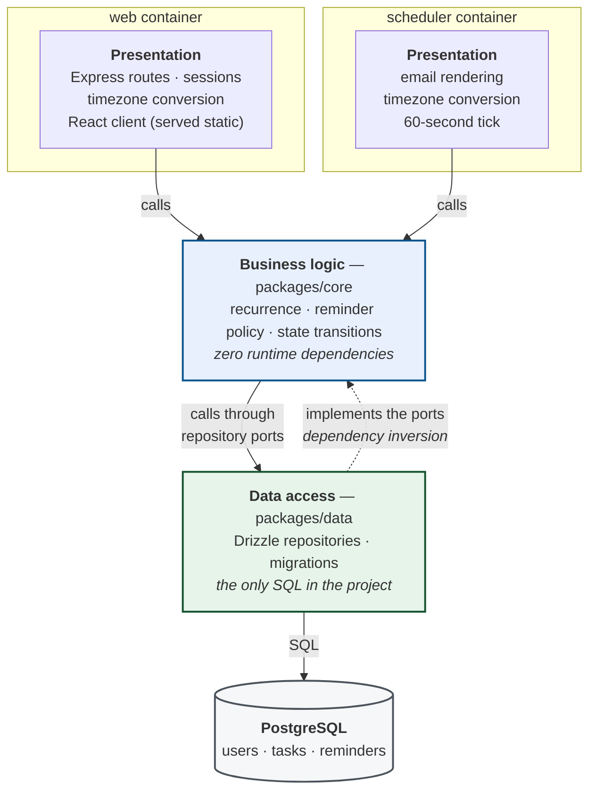
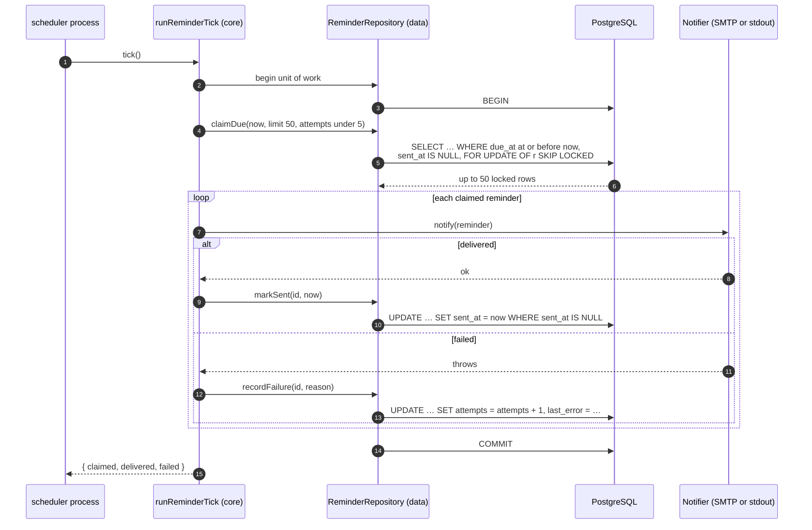

# Architecture

Two processes, four layers, one rule: **dependencies point downwards, and never
upwards.**

## The two processes

`web` and `scheduler` are separate containers built from the same workspace.
They share the business logic and data access layers through internal packages
and share nothing else — no HTTP call, no queue, no shared memory, no start-up
ordering. The scheduler reaches the database through the same repositories the
web application uses, never through its API.

## The layers

| Layer | Package | Contains | May not contain |
| --- | --- | --- | --- |
| 1. Presentation | `apps/web/src/server`, `apps/scheduler/src` | HTTP routing, request/response, sessions, **all** timezone conversion | business rules, SQL |
| 2. Business logic | `packages/core` | recurrence, reminder policy, task state transitions, auth rules | Express, an ORM, a database driver, a mail client, a date library |
| 3. Data access | `packages/data` | repository implementations, schema, migrations | business rules, HTTP |
| 4. Database | PostgreSQL 17 | tables, constraints, indexes | — |

`packages/core/package.json` declares **no runtime dependencies at all**, and a
test asserts it stays that way.

### Two presentation edges, not one

The scheduler has a presentation layer of its own, in
`apps/scheduler/src/presentation`. Writing "due at 09:00" in a reminder email
requires knowing the recipient's timezone, and that is a presentation concern
wherever it happens. HTTP and email are two edges of the same architecture; both
sit above the business logic, and neither is reachable from it.

### Why `packages/data` imports `packages/core`

At first glance this looks like an upward import. It is the opposite.

Business logic declares repository *interfaces* — ports — in
`packages/core/src/ports`. The data access layer imports those interfaces in
order to implement them, and the composition root in each process injects the
implementation. Control still flows downward at runtime: business logic calls a
repository without knowing that one exists, let alone that it speaks SQL. This
inversion is precisely what allows layer 2 to have an empty dependency list, and
what lets the entire unit suite run against in-memory fakes with no database.

## How the boundaries are enforced

The rules are written down once, in [`tools/layer-rules.json`](../tools/layer-rules.json),
and checked three times:

1. **The compiler.** Each workspace is a composite TypeScript project.
   `packages/core` references nothing, so an upward import fails `tsc --build`.
2. **The linter.** ESLint reads the same JSON and turns each forbidden import
   into an error, so CI fails before the tests run.
3. **The test suite.** [`tests/architecture.test.ts`](../tests/architecture.test.ts)
   parses every file in each layer with the TypeScript compiler API — not a
   regular expression, so a module specifier inside a comment or a string cannot
   produce a false result — and fails on any forbidden import. It also asserts
   that `packages/core` declares no runtime dependencies and contains no
   relative import escaping the package.

## Time

Everything below the presentation layer works exclusively in UTC. The database
stores `timestamptz`; the business logic layer has no timezone parameter
anywhere in its API and never parses or formats a local time.

Conversion happens in exactly two files, both in a presentation layer:
[`apps/web/src/server/presentation/timezone.ts`](../apps/web/src/server/presentation/timezone.ts)
and
[`apps/scheduler/src/presentation/reminder-email.ts`](../apps/scheduler/src/presentation/reminder-email.ts).

A deadline arrives from the client as a naive wall-clock string,
`YYYY-MM-DDTHH:mm`, and is interpreted in the account's timezone. Accepting a
pre-computed instant instead would have reduced this layer to a pass-through.
Both awkward cases have a defined answer: a time that falls in a spring-forward
gap resolves to the instant just after it, and an ambiguous time during
autumn-back resolves to the first occurrence.

Recurrence is **pure UTC instant arithmetic**: `daily` means exactly 24 hours,
not "the same wall clock tomorrow". Across a daylight-saving boundary the
instant is preserved and the local time the user reads shifts by an hour. That
is a deliberate consequence of the layering — the business logic layer has no
access to a timezone, so it cannot preserve a local wall clock and does not
pretend to. `tests/unit/recurrence.test.ts` pins the behaviour and, more
usefully, runs the same cases under four values of `TZ` to prove the arithmetic
does not depend on the host's zone. CI runs the whole suite under
`TZ=America/New_York` for the same reason.

## The reminder scheduler

The tick lives in `packages/core/src/reminders/tick.ts`, not in the worker. The
worker owns a timer, a pool and a mail transport; every rule about which
reminders are due, how failures are counted and when to give up is business
logic, and is tested without a scheduler running.

### Recovery is not a feature

A reminder whose firing time passed while the scheduler was stopped is delivered
on the next tick after it starts, and **no code makes that happen**. The claim
asks for everything due and undelivered; a reminder that came due during an
outage matches that on the next pass exactly as it would have at the time.
Catch-up logic would be a second code path doing what the first already does.

### What "exactly once" does and does not mean

Two ticks over the same due reminder send one email. Three things guarantee it,
and all three are tested against a real database:

- the row lock stops a concurrent worker claiming it;
- `sent_at IS NULL` stops a later tick re-claiming it;
- `markSent` will not stamp a row twice.

The honest limit: delivery is an external side effect and cannot join the
database transaction. If the process died between SMTP accepting a message and
the transaction committing, the stamp would roll back and the next tick would
send a second copy. The real guarantee is therefore **at-least-once delivery,
with single delivery on every path that does not involve a crash inside that
window**. Closing it completely would require the transport to accept an
idempotency key, which SMTP does not offer.

`SELECT … FOR UPDATE SKIP LOCKED` is the correct primitive for a queue drained
by several workers, and this deployment runs exactly one scheduler. It was
chosen for horizontal-scaling headroom rather than present necessity; it costs
nothing today and means a second scheduler container would be safe to add
without changing a line.

## Independent lifecycles

`docker-compose.yml` gives `web` and `scheduler` a dependency on `db` and on
nothing else. Both apply migrations on start, guarded by a Postgres advisory
lock: whichever arrives first applies them while the other waits, then finds
nothing to do. That is what makes the independence real rather than nominal —
neither process is ordered ahead of the other, and restarting or rebuilding
either leaves the other running.

Sessions are stored in Postgres rather than in memory, so restarting `web` does
not sign anybody out.

## Deliberate exclusions

The session table is a fourth table, declared separately in
`packages/data/src/session-schema.ts` and kept out of the `Database` type. It is
infrastructure owned by `connect-pg-simple`, not part of the application's data
model, and no repository or business rule touches it.

`packages/data/src/demo-tools.ts` supports the demonstration script. It is
deliberately not part of `ReminderRepository`: business logic has no reason to
drag a reminder's firing time into the past, and putting it on the port would
widen a contract every implementation must satisfy in order to serve a demo.
